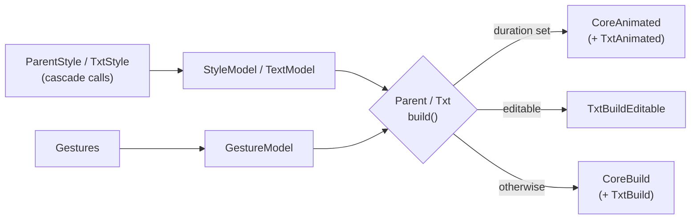

# Division — Knowledge Base

Internal reference for working **on** and **with** the `division` package
(v0.9.0). For the full, method-by-method user documentation see
[README.md](README.md); for task-oriented "how do I …?" usage of every API see
[USAGE.md](USAGE.md); for release history see [CHANGELOG.md](CHANGELOG.md).

## Contents

- [Overview](#overview)
- [Getting started](#getting-started)
- [Architecture](#architecture)
- [API quick reference](#api-quick-reference)
- [Usage recipes](#usage-recipes)
- [Development workflow](#development-workflow)
- [Troubleshooting & FAQ](#troubleshooting--faq)
- [Version history highlights](#version-history-highlights)

---

## Overview

`division` styles Flutter widgets with a CSS-like, cascade-chained syntax
instead of nested `Container`, `Padding`, `DecoratedBox` and `GestureDetector`
trees.

- **Two widgets:** `Parent` (a styled container) and `Txt` (styled text,
  optionally animated, selectable or editable).
- **Two style builders:** `ParentStyle` and `TxtStyle`, configured with
  `..method()` cascades. `TxtStyle` includes every container style, so a `Txt`
  needs no wrapping `Parent`.
- **Extras:** `Gestures` for tap/press/drag callbacks, the color helpers
  `rgb()`, `rgba()`, `hex()`, and `AngleFormat` for rotation units.
- **Requirements:** Dart SDK `^3.5.4`, Flutter only — no third-party runtime
  dependencies.
- **Links:** [repository](https://github.com/sovannDeveloper/division) ·
  [issues](https://github.com/sovannDeveloper/division/issues)

---

## Getting started

```yaml
dependencies:
  division: ^0.9.0
```

```dart
import 'package:division/division.dart';

Parent(
  style: ParentStyle()
    ..width(200)
    ..padding(all: 16)
    ..borderRadius(all: 12)
    ..background.color(Colors.blue),
  gesture: Gestures()..onTap(() => print('tapped')),
  child: Txt(
    'Hello',
    style: TxtStyle()
      ..fontSize(20)
      ..bold()
      ..textColor(Colors.white),
  ),
)
```

- `lib/division.dart` exports `Parent`, `Txt`, `ParentStyle`, `TxtStyle`,
  `Gestures`, `AngleFormat` and `rgb()`, `rgba()`, `hex()`. Everything else in
  `lib/src` is internal.
- Styles use cascades (`..`), not single-dot chaining (removed in 0.6.4).
- Without a `child` and without both `width` and `height`, `Parent` expands to
  fill its constraints.

---

## Architecture

A style object records cascade calls into a plain `StyleModel` (and, for text,
a `TextModel`). At build time the widget reads those models and wraps the child
in only the Flutter widgets the style actually uses.

### File map

| File | Lines | Role |
| --- | --- | --- |
| [lib/division.dart](lib/division.dart) | 7 | Public exports only |
| [lib/src/widget.dart](lib/src/widget.dart) | 92 | `Parent` and `Txt`; pick the animated, static or editable builder |
| [lib/src/style.dart](lib/src/style.dart) | 708 | `CoreStyle` (shared API), `ParentStyle`, `TxtStyle`, `Gestures`, `AngleFormat` |
| [lib/src/model.dart](lib/src/model.dart) | 530 | `StyleModel`, `TextModel`, `GestureModel`, plus background / alignment / overflow / text-align sub-models |
| [lib/src/build.dart](lib/src/build.dart) | 408 | `CoreBuild` (container tree), `TxtBuild`, `TxtBuildEditable` |
| [lib/src/animated.dart](lib/src/animated.dart) | 175 | `CoreAnimated`, `TxtAnimated` (`ImplicitlyAnimatedWidget`s) |
| [lib/src/dash.dart](lib/src/dash.dart) | 125 | Dashed border painter |
| [lib/src/function/](lib/src/function/) | 85 | `rgb`/`rgba`/`hex`, hex parsing, angle conversion |

### Data flow



### Key mechanics

- **Sub-models notify.** `alignment`, `alignmentContent`, `background`,
  `overflow` and `textAlign` are `ChangeNotifier` models. `CoreStyle` listens
  to them and copies their values into its private `StyleModel`. A sub-model
  method that forgets `notifyListeners()` silently has no effect (this was the
  0.9.0 `background.blendMode` bug).
- **Derived values are cached.** `StyleModel` lazily builds `decoration`,
  `constraints` and `transform` from its raw fields.
- **Merging.** `add()` calls `StyleModel.inject()`, which runs a generic
  `_replace` helper per field; `override` decides whether the incoming value
  wins. `clone()` is `Style(angleFormat: …)..add(this)`.
- **Build dispatch** ([widget.dart](lib/src/widget.dart)). `Parent` uses
  `CoreAnimated` when `duration` is set, else `CoreBuild`. `Txt` first picks
  `TxtAnimated`, `TxtBuildEditable` or `TxtBuild` for the text, then wraps it in
  the same container builder.
- **Animations never write back.** Interpolated values stay inside the animated
  state; the user's style instance is not mutated (fixed in 0.9.0).
- **Text stroke = two passes.** `TxtBuild` stacks a stroke-only `Text` under the
  fill `Text`; the stroke pass sits in `SelectionContainer.disabled` so it is
  never copied.

### Container wrapping order

`CoreBuild` ([build.dart](lib/src/build.dart)) wraps from the inside out, and
only adds a layer when its style field is set. This order explains most layout
surprises:

| # | Layer (innermost first) | Driven by |
| --- | --- | --- |
| 1 | child, or an expanding `LimitedBox` when there is no child and no tight size | `child`, `width`/`height` |
| 2 | `Align` | `alignmentContent` |
| 3 | `Padding` (style padding + decoration padding) | `padding`, `border` |
| 4 | `SingleChildScrollView` / `ClipRRect` / `OverflowBox` | `overflow.*` |
| 5 | `Material` + `InkWell` | `ripple` |
| 6 | `CustomDashedBorder` | `dashBorder` |
| 7 | `DecoratedBox` | color, gradient, border, radius, shadow, image |
| 8 | `GestureDetector` (default `HitTestBehavior.opaque`) | `Gestures` |
| 9 | `ConstrainedBox` | `width`, `height`, `min*`, `max*` |
| 10 | `Padding` | `margin` |
| 11 | `ClipRRect` + `BackdropFilter` | `background.blur` |
| 12 | `Align` | `alignment` |
| 13 | `Transform` (centered) | `scale`, `rotate`, `offset` |
| 14 | `Opacity` | `opacity` |

Consequences: the margin is **not** tappable (gestures sit inside it);
transforms and opacity apply to the whole box including margin; the dashed
border sits inside the `DecoratedBox`, so it paints over the background and the
child.

---

## API quick reference

Full signatures and examples live in [README.md](README.md). This is the map.

### `ParentStyle` / shared `CoreStyle` methods

| Area | Methods |
| --- | --- |
| Size | `width`, `height`, `minWidth`, `maxWidth`, `minHeight`, `maxHeight` |
| Spacing | `padding({all, horizontal, vertical, top, bottom, left, right})`, `margin(...)` |
| Alignment | `alignment.<pos>()`, `alignmentContent.<pos>()`, `alignment.coordinate(x, y)` |
| Background | `background.color`, `.rgba`, `.hex`, `.blur`, `.image`, `.blendMode` |
| Gradients | `linearGradient`, `radialGradient`, `sweepGradient` |
| Borders | `border`, `borderRadius`, `circle`, `dashBorder` |
| Shadows | `boxShadow`, `elevation` (last one wins) |
| Transform | `scale`, `offset`, `rotate`, `opacity` |
| Overflow | `overflow.visible`, `overflow.hidden`, `overflow.scrollable` |
| Interaction | `ripple(enable, {splashColor, highlightColor})` |
| Animation | `animate([durationMs = 500, curve = Curves.linear])` |
| Composition | `add(style, {override})`, `clone()` |

### `TxtStyle` text methods (plus everything above)

| Area | Methods |
| --- | --- |
| Font | `fontSize`, `fontWeight`, `bold`, `italic`, `fontFamily` |
| Color & effects | `textColor`, `textShadow`, `textElevation`, `textStroke` |
| Layout | `maxLines`, `letterSpacing`, `wordSpacing`, `textAlign.<x>()`, `textDirection`, `textOverflow`, `textDecoration` |
| Interaction | `selectable`, `editable({placeholder, keyboardType, obscureText, autoFocus, maxLines, onChange, onFocusChange, onSelectionChanged, onEditingComplete, focusNode})` |

### `Gestures`

Constructor: `Gestures({behavior, excludeFromSemantics, dragStartBehavior})`.
Callbacks: tap (`onTap`, `onTapDown`, `onTapUp`, `onTapCancel`, `isTap`,
`onDoubleTap`), long press, vertical / horizontal drag, pan, scale and force
press — the full `GestureDetector` set.

### Helpers

| Helper | Notes |
| --- | --- |
| `rgb(r, g, b)` | 0–255 channels, opaque |
| `rgba(r, g, b, [opacity])` | opacity 0.0–1.0 |
| `hex('…')` | `#` optional; `RGB`, `ARGB`, `RRGGBB`, `AARRGGBB`; `FormatException` on bad input |
| `AngleFormat` | `cycles` (default, 1.0 = full turn), `degree`, `radians`; set on the style constructor |

### What animates

- **Tweens:** alignment, padding, margin, size constraints, decoration (color,
  gradient, border, radius, shadow, image), scale / rotate / offset, blur,
  opacity, and text `fontSize`, `textColor`, `maxLines`, `letterSpacing`,
  `wordSpacing`, `textStroke`.
- **Switches instantly:** `dashBorder`, `fontWeight`, `fontFamily`,
  `textDecoration`, `textAlign`, `ripple`.

---

## Usage recipes

### Reusable base style

```dart
final card = ParentStyle()
  ..padding(all: 16)
  ..borderRadius(all: 12)
  ..background.color(Colors.white)
  ..elevation(4);

Parent(style: card.clone()..width(300), child: ...);
```

Always `clone()` before customising — styles are mutable and shared.

### Press-to-shrink button

```dart
bool _pressed = false;

Parent(
  style: ParentStyle()
    ..padding(horizontal: 24, vertical: 14)
    ..borderRadius(all: 30)
    ..background.color(_pressed ? Colors.deepPurple : Colors.purple)
    ..scale(_pressed ? 0.95 : 1.0)
    ..animate(150, Curves.easeOut),
  gesture: Gestures()..isTap((t) => setState(() => _pressed = t)),
  child: Txt('Press me', style: TxtStyle()..textColor(Colors.white)),
)
```

### Frosted glass panel

```dart
ParentStyle()
  ..borderRadius(all: 16) // required by blur
  ..background.rgba(255, 255, 255, 0.15)
  ..background.blur(10)
```

### Text input without a TextField

```dart
Txt(
  '',
  style: TxtStyle()
    ..padding(all: 12)
    ..border(all: 1, color: hex('cccccc'))
    ..borderRadius(all: 8)
    ..editable(
      placeholder: 'Email',
      keyboardType: TextInputType.emailAddress,
      onChange: (v) => email = v,
    ),
)
```

### Outlined heading

```dart
Txt(
  'TITLE',
  style: TxtStyle()
    ..fontSize(40)
    ..bold()
    ..padding(all: 4) // room for the outer half of the stroke
    ..textColor(Colors.white)
    ..textStroke(3, color: Colors.black),
)
```

The [example app](example/lib/demos/) has a runnable demo for every API area.

---

## Development workflow

### Repository layout

| Path | Contents |
| --- | --- |
| `lib/` | Package source (see [File map](#file-map)) |
| `test/` | `parent_test.dart`, `txt_test.dart`, `style_test.dart`, shared `helpers.dart` |
| `example/` | Gallery app: 10 demo pages (showcase, layout, decoration, transform, overflow, text, editable, gestures, animation, composition), each showing its own source |
| `.github/workflows/ci.yml` | CI on push / PR to `main` |

### Commands (same as CI)

```sh
flutter pub get
dart format --output=none --set-exit-if-changed .
flutter analyze
flutter test                       # package tests
(cd example && flutter test)       # example: opens every page, scrolls to the end
flutter pub publish --dry-run
```

Run the gallery with `cd example && flutter run`.

### Writing tests

- Wrap widgets with `host(child)` from [test/helpers.dart](test/helpers.dart)
  (a `MaterialApp` + `Scaffold` + `Center`).
- Use `decorationOf(tester)` to read the `BoxDecoration` a `Parent`/`Txt`
  painted.
- The example test fails on any layout overflow, so new demos must fit on a
  phone-sized screen.

### Lint rules

[analysis_options.yaml](analysis_options.yaml) extends `flutter_lints` with
`strict-casts`, `strict-raw-types`, `avoid_dynamic_calls`,
`prefer_final_locals`, `unawaited_futures`, `always_declare_return_types`,
`cancel_subscriptions` and `close_sinks`.

### Adding a style method — checklist

1. Add the field to `StyleModel` or `TextModel` ([model.dart](lib/src/model.dart)).
2. Add it to `inject()` so `add()` / `clone()` carry it.
3. If it lives in a `ChangeNotifier` sub-model, call `notifyListeners()` and
   make sure `CoreStyle._addListeners` copies it.
4. Consume it in `CoreBuild` / `TxtBuild` (and the animated builders if it
   should tween).
5. Add tests, a demo in `example/lib/demos/`, a README entry and a CHANGELOG
   line.

### Releasing

1. Bump `version` in [pubspec.yaml](pubspec.yaml) and the install snippet in
   the README.
2. Add a CHANGELOG section (Added / Fixed / Project).
3. Make sure CI is green, then `flutter pub publish`.

---

## Troubleshooting & FAQ

| Symptom | Cause / fix |
| --- | --- |
| `..alignment.center` does nothing | Alignment and `textAlign` entries are methods — add `()` |
| `bold(false)` / `italic(false)` / `circle(false)` doesn't reset | They only ever enable; set `fontWeight(...)` explicitly |
| Shadow disappeared | `boxShadow` and `elevation` overwrite each other (same for `textShadow` / `textElevation`) |
| `add()` didn't change anything | Existing values win by default — pass `override: true` |
| Changing one widget's style changed another | Same instance shared — `clone()` it |
| Blur looks wrong when rotated | `background.blur` does not combine with `rotate()` |
| Taps on the margin are ignored | By design: gestures wrap inside the margin layer |
| Stroke edges are clipped | Half the stroke is outside the glyph — add `padding` |
| `textStroke` has no effect | Not supported on `editable` fields |
| Drag-select can't span two `Txt`s | Each `selectable` is its own region; wrap them in one `SelectionArea` instead |
| Selection fights with `Gestures` | Selection installs long-press / drag recognizers; avoid combining them |
| `background.image` throws `ArgumentError` | Pass one of `imageProvider`, `path` or `url` |
| `hex()` throws `FormatException` | Only 3, 4, 6 or 8 hex digits are valid |
| My `FocusNode` stops working after dispose | Since 0.9.0 the widget only disposes nodes it created — you own yours |

---

## Version history highlights

| Version | Highlights |
| --- | --- |
| 0.9.0 | Stability release: `selectable`, `textStroke`; ~20 crash and behaviour fixes (blur without radius, animations mutating styles, opaque gesture hit-testing, editable placeholder / focus / controller lifecycles, `hex()` returning plain `Color`); 78 package tests + CI |
| 0.8.8 | `editable(autoFocus)`, `textOverflow` |
| 0.8.7 | `textShadow`, `textElevation`, `circle`, `background.blendMode` |
| 0.8.6 | `GestureClass` → `Gestures`; removed `S`/`G` aliases |
| 0.8.0 | `Division` → `Parent`; new `Txt` widget; `AngleFormat` replaces `useRadians` |
| 0.7.0 | Typed API: `background.*`, `alignment.*`, `overflow.*` |
